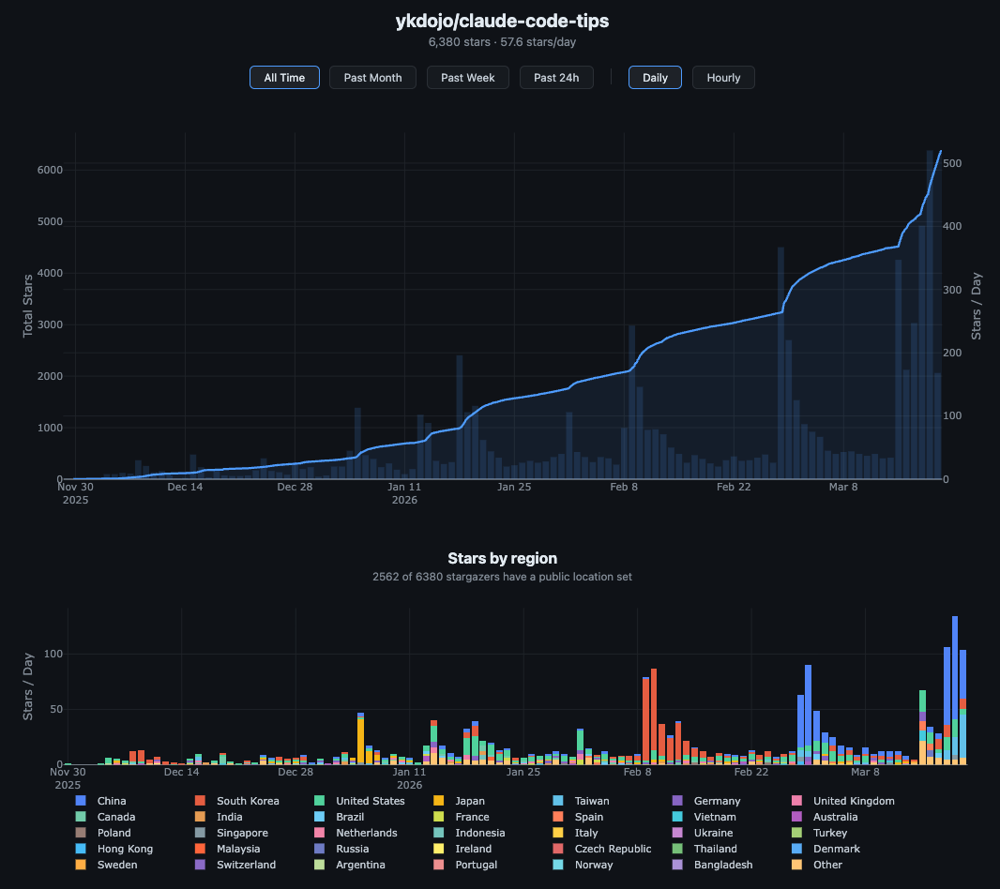
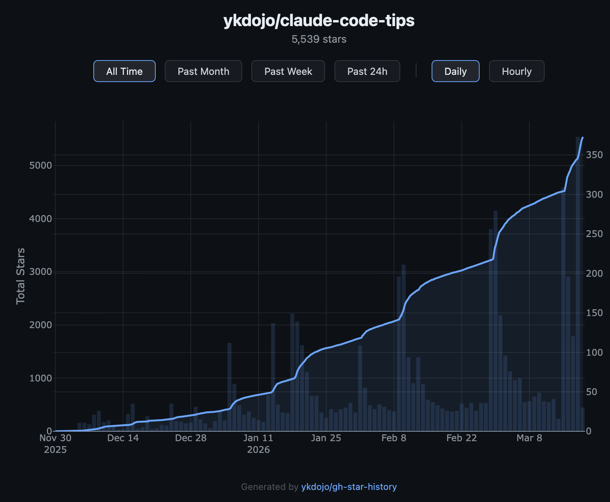
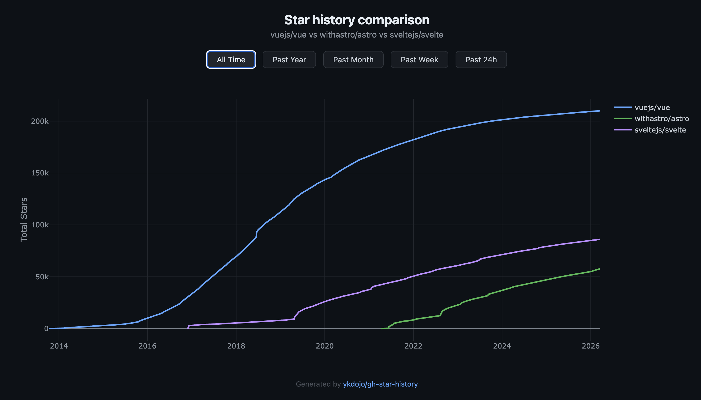
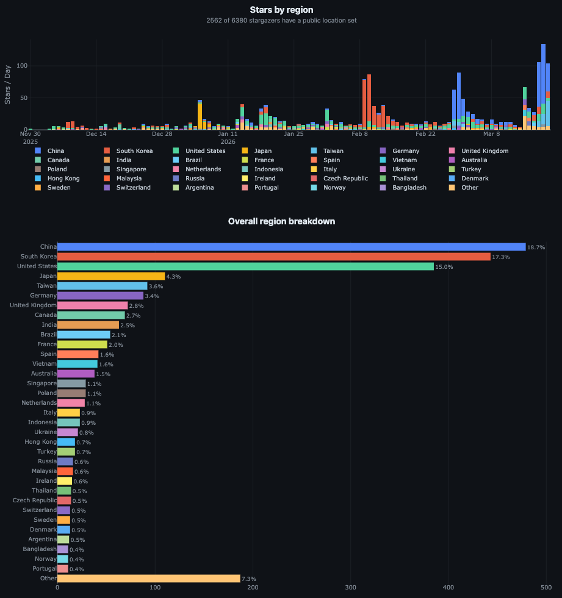

# gh-star-history



Visualize and compare GitHub star history as interactive charts. Powered by the [GitHub CLI](https://cli.github.com/) - no API tokens needed.

For example, if you want to see the star growth of [claude-code-tips](https://github.com/ykdojo/claude-code-tips):

```
npx gh-star-history ykdojo/claude-code-tips
```



Or compare multiple repos:

```
npx gh-star-history vuejs/vue withastro/astro sveltejs/svelte
```



Generates a self-contained HTML file with an interactive Plotly chart - hover for details, zoom into spikes, pan across time.

## Prerequisites

- [Node.js](https://nodejs.org/) >= 16
- [GitHub CLI](https://cli.github.com/) installed and authenticated (`gh auth login`)

## Usage

```bash
npx gh-star-history <owner/repo or URL> ... [options]
```

Accepts both formats, and multiple repos:
```bash
npx gh-star-history ykdojo/claude-code-tips
npx gh-star-history https://github.com/ykdojo/claude-code-tips
npx gh-star-history vuejs/vue withastro/astro sveltejs/svelte
```

### Options

| Flag | Description |
|------|-------------|
| `--style <name>` | Chart style: `blue` (default), `green`, `purple` (single repo only) |
| `--output <path>` | Output file path (default: `star-history.html`) |
| `--no-open` | Don't auto-open the browser |
| `--no-cache` | Skip cache and fetch fresh data |
| `-h, --help` | Show help |

### Examples

```bash
# Default blue style
npx gh-star-history ykdojo/claude-code-tips

# Green accent
npx gh-star-history ykdojo/claude-code-tips --style green

# Save to specific file
npx gh-star-history torvalds/linux --output linux-stars.html

# Compare multiple repos
npx gh-star-history vuejs/vue withastro/astro sveltejs/svelte
```

## Styles

Three styles matching GitHub's dark theme palette:

- **blue** (default) - `#58a6ff`
- **green** - `#3fb950`
- **purple** - `#bc8cff`

## How it works

1. Fetches stargazer timestamps via GitHub's GraphQL API (no pagination limit)
2. Caches results to `~/.gh-star-history/` (one file per repo) - subsequent runs only fetch new stars
3. Generates a self-contained HTML file with [Plotly.js](https://plotly.com/javascript/) loaded from CDN
4. Opens it in your default browser

The cache saves after every batch, so even if a large fetch gets interrupted, progress is kept. Single-repo charts show both cumulative stars (line) and stars per day (bars) on a dual-axis layout. Multi-repo charts show cumulative lines with a legend for comparison.

## Region breakdown

You can also generate a region breakdown chart showing where stargazers are from, based on their public GitHub location. Since location strings are freeform, AI is needed to classify them - use the `/gh-star-region-breakdown` skill in Claude Code to handle fetching, classification, and chart generation.



The region breakdown includes:

- A stacked bar chart showing stars by region over time (top 5 regions per day)
- An overall breakdown horizontal bar chart with percentages
- Hover over "Other" to see the full breakdown of smaller regions

The region data responds to the time range and daily/hourly toggles.

## Development

```bash
git clone https://github.com/ykdojo/gh-star-history.git
cd gh-star-history
node bin/cli.js ykdojo/claude-code-tips
```

## License

MIT
